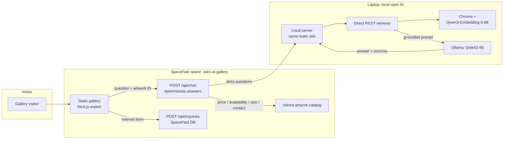

# Zak's AI Gallery Guide

> A private, artist-grounded AI guide for Zak's solo exhibition
> **Thresholds**: explore the show, hear the stories behind individual
> works, and contact Zak about available pieces.

## The problem

Zak has a physical exhibition, but many interested people will never
visit the gallery. Ordinary online galleries show images and prices.
They don't recreate the conversation that happens beside a painting.

## The product

A single-exhibition website where every artwork carries verified price
and availability, and an AI guide answers visitor questions **only from
Zak's approved material**: artist notes, the exhibition statement, and
the artwork catalog. When Zak's notes don't cover a question, the guide
says so instead of inventing an interpretation. One tap turns curiosity
into a buyer inquiry with the exact artwork attached.

The memorable demo: open *Blue Passage* → ask "What inspired this
piece?" → get a grounded answer with source labels → ask "Is it
available, and how much?" → see structured data → "I'm interested" →
inquiry sent.

## Architecture



**Why two runtimes?** SpaceFast serves static files + serverless
functions + a database. It cannot run Ollama, local models, or a
persistent Chroma. So:

- **Public SpaceFast deployment**: full gallery, deterministic commerce
  answers (price/availability/dimensions/medium/contact/similar works)
  from the catalog, inquiry capture to the database. Story questions get
  an honest "the full guide runs locally" message.
- **Local AI mode** (`npm run local`): the same site with the full RAG
  pipeline (direct REST calls to Chroma with Qwen3-Embedding 0.6B, then
  Ollama with Qwen3 4B) for the recorded 2-minute demo and Zak's own use.

This is the challenge's recommended strategy: *public frontend plus a
documented local AI mode.*

## Local prerequisites

- Node.js 20+, Docker

```bash
docker compose up -d
docker exec zaks-ollama ollama pull qwen3:4b
docker exec zaks-ollama ollama pull qwen3-embedding:0.6b
npm install
npm run ingest     # embed content/ -> Chroma
npm run build && npm run local   # http://localhost:3100, full RAG
```

## Content schema

Single source of truth lives in `content/`:

- `content/artworks.json` — the catalog (price + availability are
  **authoritative**; the app reads them from here, never from the LLM)
- `content/artworks/<id>.md` — Zak's notes per work (`## Inspiration`,
  `## Themes`, `## Process` sections become semantic chunks)
- `content/exhibition.md`, `content/artist-bio.md`

`scripts/build-catalog.mjs` inlines the catalog into
`functions/_core/catalog.ts` for the serverless functions. To re-skin for
another artist: replace images, edit `artworks.json`, add Markdown notes,
run `npm run ingest`, start the stack.

## Privacy & AI disclosure

- The guide answers from Zak's artist notes, exhibition statement, and
  approved artwork details. It may not know everything, and it says when
  Zak has not provided an answer.
- Story answers are generated locally by open-weight models; visitor
  questions never go to a closed-model provider in local mode.
- Submitting the interest form does not reserve the artwork.

## Evaluation

15 questions across grounded facts, storytelling, discovery, unknown
information, and adversarial prompts: `evals/questions.json`.
Run against the local server with `npm run eval`. Pass criteria: 100%
correct prices/availability, no invented artist facts, unknown questions
acknowledged, buyer inquiry always carries the correct artwork ID, and
Zak judges ≥4/5 story answers accurate.

## Limitations

- Small local models need tight prompting. RAG doesn't guarantee truth
  by itself, which is why prices never come from the model.
- One exhibition, six works in this build; not a multi-artist platform.
- No payment, accounts, reservations, or analytics, by design.

## License

MIT. Artwork images and artist notes in `content/` are Zak's (sample
placeholders in this scaffold). Not covered for reuse.

## Credits

Built for the open-source AI challenge. Concept, artwork, and words:
Zak. Open stack: Ollama, Qwen3, Chroma, Next.js, SpaceFast.
